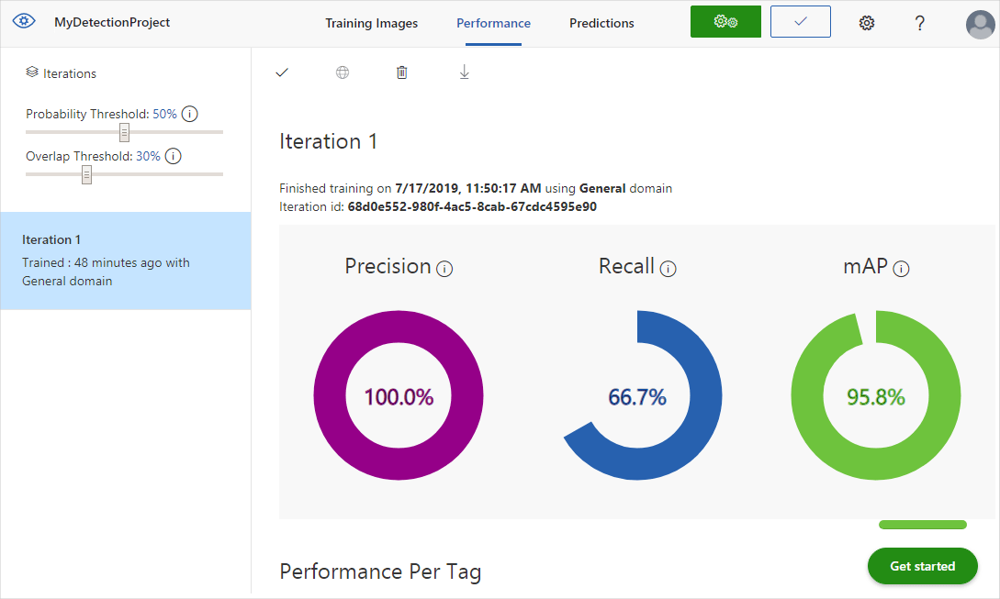
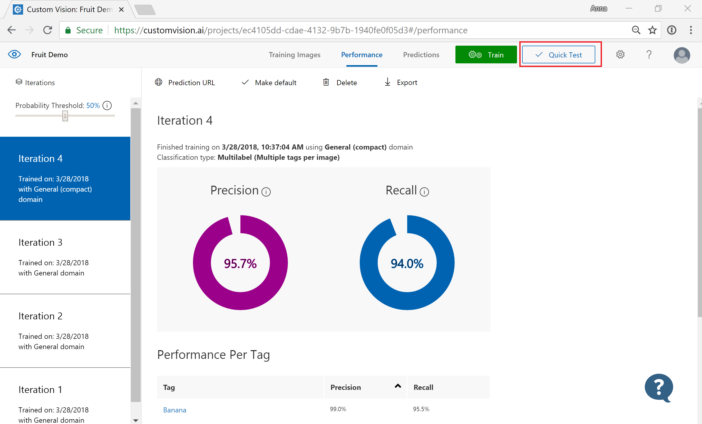

# Task 6 - Train and test your model

With your training data uploaded and tagges, you can now start training the model - and test how it performs.

## Train the model

To train the detector model, select the **Train** button, then select **Quick Training**. The detector uses all of the current images and their tags to create a model that identifies each tagged object.

The training process should only take a few minutes. During this time, information about the training process is displayed in the **Performance** tab. This is a great time to take a break!

## Evaluate the model

After training has completed, the model's performance is calculated and displayed. The Custom Vision service uses the images that you submitted for training to calculate precision, recall, and mean average precision. Precision and recall are two different measurements of the effectiveness of a detector:

- **Precision** indicates the fraction of identified classifications that were correct. For example, if the model identified 100 images as dogs, and 99 of them were actually of dogs, then the precision would be 99%.
- **Recall** indicates the fraction of actual classifications that were correctly identified. For example, if there were actually 100 images of apples, and the model identified 80 as apples, the recall would be 80%.
- **Mean average precision** is the average value of the average precision (AP). AP is the area under the precision/recall curve (precision plotted against recall for each prediction made).

    

## Test the model
1. From the [Custom Vision web page](https://customvision.ai), select your project. Select **Quick Test** on the right of the top menu bar. This action opens a window labeled **Quick Test**.

    

2. In the **Quick Test** window, click in the **Submit Image** field and enter the URL of the image you want to use for your test. If you want to use a locally stored image instead, click the **Browse local files** button and select a local image file.

    

The image you select appears in the middle of the page. Then the results appear below the image in the form of a table with two columns, labeled **Tags** and **Confidence**. After you view the results, you may close the **Quick Test** window.

Hopefully, your model was able to detect the object correctly. Try testing with a few more photos that you have taken (or found on the web). If your model is not performing well, try training it with a few more images. When your model is reliable, you can [move on to publishing it](07-Publish%20your%20model.md).

